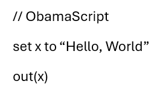

# ObamaCactus++

## What is ObamaCactus?
Imagine you are out somewhere, without your computer. All of a sudden, you get a stroke of **Genius!** 

A solution to a problem you have been stuck with for **ages!**

Wish you could just write code on paper, and **Compile** it?

**Well now you can!**
### - Input


*(page.png, taken from a word document)*

### - Output
```output
Hello, World
```

## Setup
1. Download the version of your choice from **Releases**
4. Extract the version's **ZIP** file.
5. Run **`ObamaScriptInstaller.exe`**
6. Restart all instances of terminal *(This includes Visual Studio Code)*
7. You can now use the **`obama`** command!

## Commands
Run a *.obama program
```powershell
obama -r <name>.obama
```
OCR + Compile a *.png file
```powershell
obama -r <name>.png
```

## Dependencies
> **Windows 10+**

> Tesseract
```powershell
winget install --id tesseract-ocr.tesseract --exact
```

